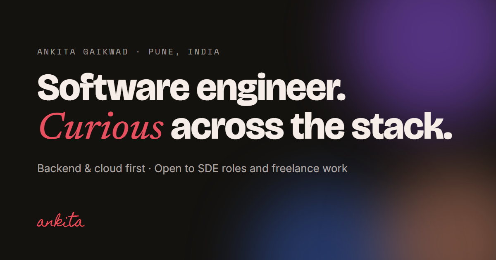

# Ankita Gaikwad · Portfolio

My personal portfolio: work, projects, and a few things I built for fun.

**Live:** [ankitagaikwad.vercel.app](https://ankitagaikwad.vercel.app)



## What's inside

- **Homepage**: about me, experience, projects, skills, and contact.
- **A working terminal** in the hero. Try `help`, `projects`, `experience`, `resume` or `joke`.
- **The Lab** (`lab.html`): small interactive experiments.
  - `flow-field.js`: a particle field driven by hand-written simplex noise
  - `maze.js`: generates a maze with a recursive backtracker, then solves it with BFS or DFS
  - `sort-sonic.js`: sorting algorithms you can hear, using the Web Audio API
  - `bounce.js`: click to drop balls that bounce and collide

## Built with

Plain HTML, CSS and JavaScript, with Canvas and the Web Audio API. No frameworks, libraries or build step.

## Structure

```
index.html      homepage
lab.html        the Lab
css/            styles
js/             terminal, Lab experiments, background effects
img/            link-preview image
resume.pdf      résumé
```

## Run locally

It's a static site, so any local server works:

```bash
python -m http.server 8000
```

Then open http://localhost:8000.

## Deployment

Hosted on Vercel. Every push to `main` deploys automatically.
